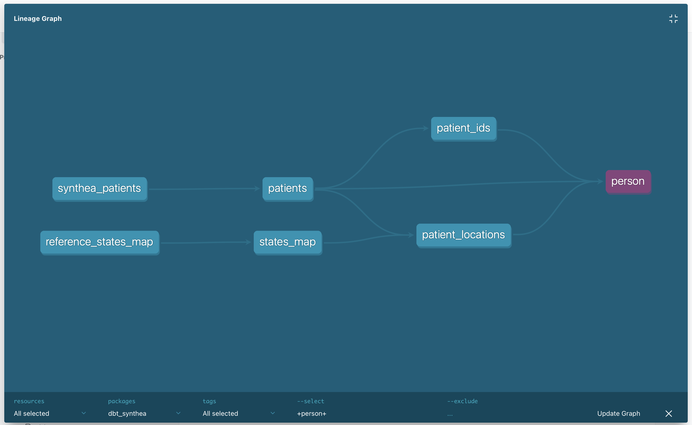
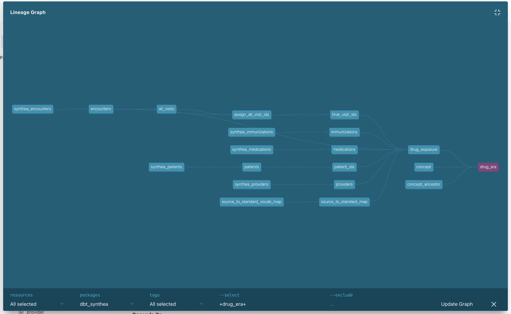

# dbt Synthea for Synthea to OMOP

This tutorial mirrors the [SQLMesh-Synthea tutorial](../sqlmesh-synthea/) using dbt and DuckDB, with a step‑by‑step guide from raw Synthea CSVs to OMOP CDM 5.4 tables.

## Reasons for using dbt

- dbt is a widely adopted open-source tool in the data engineering community and has a large ecosystem of connectors, plugins, and community support.
- dbt has been a pioneer in the "analytics engineering" space, popularizing SQL-based transformation workflows and best practices.
- dbt's simplicity and focus on SQL make it accessible to analysts and data engineers alike, fostering collaboration across teams.
- dbt's modular approach with models, seeds, and tests allows for organized and maintainable codebases.
- dbt's integration with modern data stack tools (like Snowflake, BigQuery, Redshift, and DuckDB) makes it versatile for various data environments.

## Prerequisites (same as SQLMesh tutorial)

- [Python](https://www.python.org/downloads/)
- [`uv`](https://docs.astral.sh/uv/getting-started/installation/) for managing virtual environments and dependencies
- [`duckdb`](https://duckdb.org/docs/installation/) for the database
- Local copy of the Synthea source data under `../../data/syntheaRaw/` and OMOP vocabulary CSVs under `../../data/vocabulary/` (already included in this repository).

## Project layout

- `seeds/`: CSV copies staged via `dbt seed` into the `synthea`, `vocab`, and `reference` schemas.
- `models/staging`: normalized staging tables in the `stg` schema.
- `models/omop`: OMOP CDM 5.4 core entities (person, visit occurrence, etc.) in the `omop` schema.
- `dbt_project.yml`: dbt configuration (materializations, schemas, seed settings).
- `profiles.yml.example`: example DuckDB profile (copy to `~/.dbt/profiles.yml`).
- `scripts/sync_seeds.py`: helper to copy raw/vocab CSVs into `seeds/`.
- `dbt_synthea.duckdb`: DuckDB database file created by dbt (path from profile).

Note on schemas in DuckDB: dbt-duckdb composes the default database `main` with your dbt schema. For example, models configured with schema `omop` are materialized under schema `main_omop` in DuckDB, and staging models under `main_stg`. Seeds land in `main_synthea`, `main_vocab`, and `main_reference`.

## Quick Start

1. Change into the project directory

```bash
cd etl/dbt-synthea
```

1. Create and activate a virtual environment and install dependencies

```bash
uv venv
```

2. Activate the environment:
   - macOS / Linux (bash, zsh): `source .venv/bin/activate`
   - Windows PowerShell: `.venv\Scripts\Activate.ps1`
   - Windows Command Prompt: `.venv\Scripts\activate.bat`

3. Install project dependencies inside the active environment

```bash
uv sync
```

4. Configure your dbt profile (one‑time)

```bash
mkdir -p ~/.dbt
cp profiles.yml.example ~/.dbt/profiles.yml
```

- Optionally edit `~/.dbt/profiles.yml` to change the DuckDB file path (`path:`) or `threads:`.

5. Populate the dbt seed directory (re‑run whenever the source CSVs change)

```bash
python scripts/sync_seeds.py
```

6. Verify connectivity and environment

```bash
dbt debug
```

7. Build the project

- Recommended one‑shot command:

```bash
dbt build
```

- Or run explicit steps:

```bash
dbt seed
dbt run
dbt test
```

8. Explore data in DuckDB CLI

```bash
duckdb dbt_synthea.duckdb
```

Example queries:

```sql
SELECT * FROM main_omop.person LIMIT 5;
SELECT COUNT(*) FROM main_omop.person;
SELECT COUNT(*) FROM main_omop.condition_occurrence WHERE condition_concept_id = 437663; -- fever
```

## Select only what you need (faster dev cycles)

dbt’s node selection helps you iterate quickly without rebuilding the full DAG.

- Rebuild a single model (and its parents):

```bash
dbt run -s +models/omop/person.sql
```

- Rebuild a staging model and all downstream dependents:

```bash
dbt run -s models/staging/patients.sql+
```

- Work by folder or tag:

```bash
dbt run -s models/omop/*
dbt run -s tag:core
```

- Preview selections without running:

```bash
dbt ls -s models/staging/*
```

- Run tests for a subset:

```bash
dbt test -s path:models/omop/*
```

More patterns: <https://docs.getdbt.com/reference/node-selection/syntax>

## Docs and lineage

- Build docs: `dbt docs generate`
- Serve docs locally: `dbt docs serve`

This opens an interactive site with model descriptions and a table‑level lineage graph.


**Simple lineage of `person` table. (The actual lineage is interactive and zoomable.)**


**More complicated lineage of `drug_era` table.**

Note: Column‑level lineage in dbt is a paid feature (dbt Cloud). dbt Core shows table‑level lineage only. In contrast, SQLMesh provides column‑level lineage for free in open source.

## Other operations

- Full refresh of materializations: `dbt run --full-refresh`
- Clean build artifacts (`target/`, etc.): `dbt clean`
- Switch threads: update `threads:` in `~/.dbt/profiles.yml`
- Change DuckDB file location: update `path:` in `~/.dbt/profiles.yml` (default is `dbt_synthea.duckdb` in this folder).

## Troubleshooting

- “Profile not found” or connection issues: run `dbt debug` and ensure `~/.dbt/profiles.yml` exists and matches the example.
- Missing seed files: re‑run `python scripts/sync_seeds.py`, confirm inputs exist under `../../data/syntheaRaw/` and `../../data/vocabulary/`, then `dbt seed`.
- Out‑of‑memory with large vocabularies: reduce `threads:` temporarily and retry; DuckDB can also benefit from `PRAGMA memory_limit='4GB';` set at session start if needed.
- Stale objects: run `dbt run --full-refresh` or `dbt clean` then rebuild.

## dbt vs SQLMesh

This dbt-synthea demo closely follows the [sqlmesh-synthea](../sqlmesh-synthea/) to allow side‑by‑side comparison of the two tools and their approaches to the same problem.

SQLMesh was created after dbt and addresses some of its limitations. Key differences include:

- **SQL understanding vs. templating:** dbt templates SQL text, while SQLMesh parses SQL to understand columns and dependencies, enabling earlier error detection and column‑level lineage.
- **Environments:** dbt uses targets/schemas; SQLMesh offers virtual data environments with easy promotion and backfills.
- **Data quality:** dbt tests are supported (this repo keeps them minimal). SQLMesh adds first‑class audits that can block promotions when rules fail.
- **Cross‑dialect SQL:** dbt relies on adapters/macros; SQLMesh includes SQL transpilation for portability between engines.
- **Incremental processing:** both support incremental models; configuration and behavior differ.

For a deeper dive, see: [SQLMesh — Comparisons](https://sqlmesh.readthedocs.io/en/stable/comparisons/)

## Further reading

- Full, step‑by‑step tutorial: [OHDSI/dbt-synthea](https://github.com/OHDSI/dbt-synthea)
- dbt docs: <https://docs.getdbt.com/docs/introduction>
