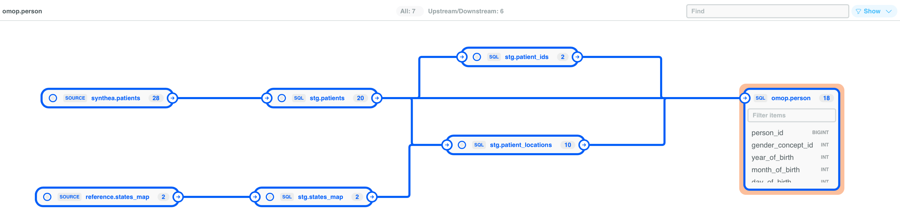
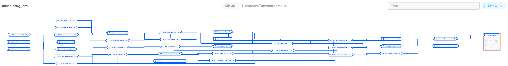

# SQLMesh Synthea OMOP Tutorial

This tutorial shows how to load the Synthea synthetic patient dataset into the OMOP CDM v5.4 using [SQLMesh](https://sqlmesh.com/). It is intentionally minimal and mirrors the straightforward SQL patterns found in the original `ETL-Synthea`, but without the R scripts.

## Reasons for using SQLMesh

- **Simplicity**: SQLMesh uses plain SQL files to define models, making it easy to read and maintain.
- **SQL Semantic Understanding:** Unlike dbt that just template text, SQLMesh parses and understands the SQL code itself. This allows it to catch bugs before a query is run on the database and to create detailed column-level lineage, tracking exactly how data flows and transforms.
- **Virtual Data Environments:** It allows developers to safely work in isolated development environments without interfering with the production data, even while using the same physical database.
- **Data Contracts & Audits:** SQLMesh can enforce data quality rules (audits) to ensure the transformations are complete and accurate before the data is promoted for use. If a transformation is incomplete, it blocks the flawed data from entering production.
- **SQL Transpilation:** It can automatically translate SQL syntax between different database systems (e.g., from Microsoft SQL Server to DuckDB), which is invaluable for migrations and collaboration.
- **Incremental Models:** For large datasets, SQLMesh can be configured to process only new or changed data, dramatically reducing run times from hours to minutes.
- **Open Source & Free:** SQLMesh is fully open source and free to use, with no licensing fees.

## Prerequisites

- [Python](https://www.python.org/downloads/)
- [`uv`](https://docs.astral.sh/uv/getting-started/installation/) for managing virtual environments and dependencies
- [`duckdb`](https://duckdb.org/docs/installation/) for the database
- Local copy of the Synthea source data under `../../data/syntheaRaw/` and OMOP vocabulary CSVs under `../../data/vocabulary/` (already included in this repository).

## Project Layout

```bash
etl/sqlmesh-synthea/
├── audits/                 # Data quality checks
├── models/
│   ├── seeds/              # SQLMesh SEED models pointing to raw Synthea & vocabulary CSVs
│   ├── staging/            # Raw Synthea extracts normalized for downstream joins
│   └── omop/               # OMOP CDM tables built from the staging layer
├── seeds/                  # Seed data files
├── config.yaml             # SQLMesh project configuration
├── pyproject.toml          # Dependency declarations managed by uv
└── uv.lock                 # Reproducible dependency lockfile
```

## Quick Start

1. Change into the tutorial directory:

   ```bash
   cd etl/sqlmesh-synthea
   ```

2. Create a virtual environment with `uv` (works on macOS, Linux, and Windows):

   ```bash
   uv venv
   ```

3. Activate the environment:
   - macOS / Linux (bash, zsh): `source .venv/bin/activate`
   - Windows PowerShell: `.venv\Scripts\Activate.ps1`
   - Windows Command Prompt: `.venv\Scripts\activate.bat`

4. Install project dependencies inside the active environment:

   ```bash
   uv pip install -e .
   ```

5. Check SQLMesh connection:

   ```bash
   sqlmesh info
   ```

6. Apply model plan to a dev environment:

   ```bash
   sqlmesh plan dev
   ```

   > The first `sqlmesh plan` streams the vocabulary CSV seeds (concept, concept_ancestor, etc.). This can take a minute, but subsequent runs reuse the DuckDB tables. There will be some Pandas warnings that can be ignored in this tutorial context.

7. Explore the materialized data via a database client or DuckDB CLI:

   ```bash
   duckdb sqlmesh-synthea.duckdb
   ```

   Example queries:

   ```sql
   SELECT * FROM omop__dev.person LIMIT 5;
   SELECT COUNT(*) FROM omop__dev.person;
   SELECT COUNT(*) FROM omop__dev.condition_occurrence WHERE condition_concept_id = 437663; -- fever
   ```

   > Notice the schema name `omop__dev` indicating the `dev` environment. You can create multiple environments and switch between them with the `--env` flag in SQLMesh commands. The `prod` environment will have no suffix, just `omop` as the schema name.

8. If data in dev environment looks good, promote the plan to dev:

   ```bash
   sqlmesh plan
   ```

### Exploring data lineage and selecting models

SQLMesh parse our SQL scripts and automatically create column-level data lineage of dependency. If you want a visual data lineage, launch the SQLMesh UI with `sqlmesh ui` or try [SQLMesh VS Code extension](https://sqlmesh.readthedocs.io/en/stable/guides/vscode/), though it can be a little clunky to set up.


**Simple lineage of `person` table. (The actual lineage is interactive and zoomable.)**


**More complicated lineage of `drug_era` table**

You don’t always need to run the full DAG. Use `--select-model` to focus a plan on specific models and their dependencies to speed up development.

- Downstream from a staging node: `sqlmesh plan --select-model "stg.patients+"`
  - This selects the staging model and any changed downstream models, letting you iterate quickly on person logic and its consumers.
- Upstream into a target: `sqlmesh plan --select-model "+omop.person"`
  - The leading `+` brings in changed upstream parents so you can verify inputs that feed `omop.person`.
- Combine wildcards and `+` for broader slices (for example, `+omop.*+` or `stg.*patient*+`).

More selector patterns and examples: [SQLMesh Model Selection Guide](https://sqlmesh.readthedocs.io/en/stable/guides/model_selection/)

### Audits (Data Quality Checks)

This tutorial bakes the DQD audits into the SQLMesh pipeline that automatically run during `sqlmesh run` or can be invoked ad‑hoc with:

```bash
sqlmesh audit
```

How they’re wired:

- Each audit is defined in `audits/*.sql` (for example, `audits/person_audits.sql`).
- Models reference one or more audit names in their `MODEL (...)` block. For example, `models/omop/person.sql` includes nullability, foreign key, and concept validity checks for OMOP person fields.

Example (abridged from `omop.person`):

```sql
MODEL (
   name omop.person,
   ...,
   audits (
      person_exists,
      person_person_id_is_primary_key,
      person_gender_concept_id_is_required,
      person_race_concept_id_is_required,
      ...
   )
)
```

Where do these audits come from? They were generated from the Data Quality Dashboard (DQD) rules and published in the companion tutorial. See “Part 6 — Audits” for details and regeneration steps:
[Companion tutorial — Part 6: Audits](https://github.com/sidataplus/demo-etl-sqlmesh-omop-synthea?tab=readme-ov-file#part-6-audits)

Add your own audits:

1. Create a new audit in `audits/your_model_audits.sql` using the `AUDIT (name ..., blocking ...)` syntax from the SQLMesh docs.
2. Reference the new audit name inside the target model’s `MODEL (...) audits (...)` list.
3. Run `sqlmesh plan` and `sqlmesh run` (or `sqlmesh audit`) to execute them.

Audit reference: [SQLMesh Audits](https://sqlmesh.readthedocs.io/en/stable/concepts/audits/)

## Other Operations

### Run transformations

After you’ve planned changes, you can execute the pipeline (for example, incremental schedules) with:

```bash
sqlmesh run
```

Optionally scope runs by environment or time window:

```bash
sqlmesh run --env dev
sqlmesh run --start '2020-01-01' --end '2020-01-31'
```

### Table diff (compare environments or tables)

Validate changes by diffing schemas and row values between environments or specific tables.

- Diff a model across environments (for example, prod vs dev):

```bash
sqlmesh table_diff prod:dev omop.person
```

Add samples to the output:

```bash
sqlmesh table_diff prod:dev omop.person --show-sample
```

If the model doesn’t define a unique, not‑null grain, specify join keys explicitly (for example, the person primary key):

```bash
sqlmesh table_diff prod:dev omop.person -o person_id
```

- Diff multiple models using selection:

```bash
sqlmesh table_diff prod:dev -m "+omop.person"   # include upstream parents
sqlmesh table_diff prod:dev -m "omop.*"        # all OMOP models
```

- Diff tables/views directly (DuckDB schemas: `omop` vs `omop__dev`):

```bash
sqlmesh table_diff omop.person:omop__dev.person -o person_id --show-sample
```

Notes:

- Ensure both sides exist (plan/apply to each environment first).
- For accurate joins, define `grain` in the model or pass `-o` once per join column.
- Guide: <https://sqlmesh.readthedocs.io/en/stable/guides/tablediff/>

## Further reading

- Full, step‑by‑step tutorial: [sidataplus/demo-etl-sqlmesh-omop-synthea](https://github.com/sidataplus/demo-etl-sqlmesh-omop-synthea)
- SQLMesh documentation: [sqlmesh.readthedocs.io](https://sqlmesh.readthedocs.io/en/stable/)
